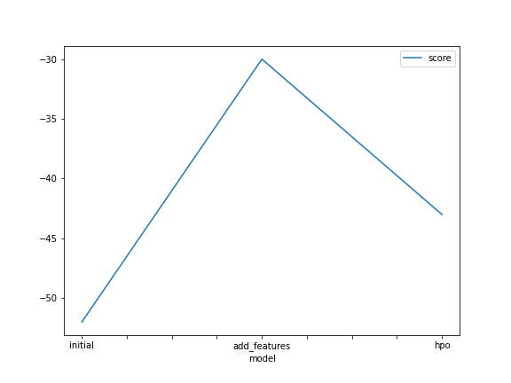

# Report: Predict Bike Sharing Demand with AutoGluon Solution

#### Mohamed Amin Salah Mohamed

## Initial Training

### What did you realize when you tried to submit your predictions? What changes were needed to the output of the predictor to submit your results?

The type of the model is a regression model and I set the evaluation metric as rmse. Also, as this problem is regression, the model may predict wiht negative values which aren't appropriate as the model predicts the number of bikes.

### What was the top ranked model that performed?

WeightedEnsemble_L3

## Exploratory data analysis and feature creation

### What did the exploratory analysis find and how did you add additional features?

I found that most of the features affects the number of demanded bikes like wind speed if it is high, a few people will ride the bikes but if it is low the number of people that will ride the bikes increases. I tried to separeate the hour feature from the datetime feature.

### How much better did your model preform after adding additional features and why do you think that is?

the results were improved from 1.8 rmse to 0.67 rmse as the hour feature has highly effect on the count of bikes if it is a rush hour or not.

## Hyper parameter tuning

### How much better did your model preform after trying different hyper parameters?

the results were improved from 0.67 rmse to 0.56 rmse and there is no overfitting after hyperparmater tuning.

### If you were given more time with this dataset, where do you think you would spend more time?

I will spend more time on exploring features and hyperparmater tuning.

### Create a table with the models you ran, the hyperparameters modified, and the kaggle score

|model|time_limit|num_bag_folds|num_trials|score|
|--|--|--|--|--|
|initial|600|0|1|1.8|
|add_features|600|0|1|0.67|
|hpo|800|5|5|0.56|

### Create a line plot showing the top model score for the three (or more) training runs during the project

### Create a line plot showing the top kaggle score for the three (or more) prediction submissions during the project

### Time Series of Bike-Sharing demand

## Summary

This project is a good starter to know how to deal with ML problems. Exploring the features and knowing the importance of each feature will help you ignore the useless features. In addition to that splitting the features into new feature may help the model to get higher results. Hyper-paramter tuning phase is very crucial phase, as it may give high results but the model may suffer from overfitting. In my case, I tried to use num_bag_folds with num_stack_levels to avoid overfitting that happend when I add the new feature.
